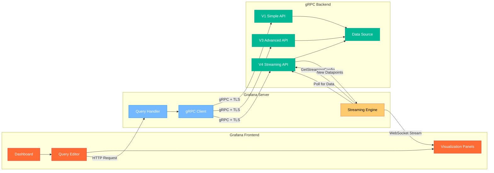

# Grafana Simple gRPC Datasource Plugin


[](https://grafana.com/grafana/plugins/innius-grpc-datasource)
[](https://grafana.com/grafana/plugins/innius-grpc-datasource)

A powerful Grafana datasource plugin that connects to gRPC backends using a
standardized API specification. This plugin decouples frontend visualization
from backend data implementation, providing flexibility and maintainability for
time-series data visualization.

## Architecture Overview



**Key Architecture Points:**
- **Server Plugin Polling**: The streaming engine polls the gRPC backend at configurable intervals (not push-based)
- **WebSocket Streaming**: Real-time data is streamed from server plugin to frontend
- **API Version Support**: Automatic detection of V1/V3/V4 capabilities via gRPC reflection
- **Secure Communication**: All gRPC calls use TLS encryption with optional API key authentication

The architecture demonstrates how the Grafana server plugin acts as an intermediary, polling the gRPC backend at configurable intervals and streaming the results to the frontend via WebSocket connections.

## Key Features

- **Multiple API versions** - Support for Simple (V1), Advanced (V3), and
  Streaming (V4) APIs
- **Multi-metric queries** - Select multiple metrics in a single query
- **Flexible dimensions** - Dynamic dimension selection with key-value pairs
- **Grafana integration** - Full support for variables, templating, and labels
- **Streaming support** - Real-time data with configurable polling intervals
  (V4)
- **Custom query options** - Backend-defined query parameters
- **Enhanced metadata** - Support for units, value mappings, and notifications
- **Secure connections** - TLS encryption with optional API key authentication

## Why gRPC?

- **Performance** - Fast and efficient inter-service communication
- **Type safety** - Strongly-typed API contracts through Protocol Buffers
- **Language agnostic** - Implement backends in any supported language
- **Streaming ready** - Built-in support for real-time data streaming
- **Standardized** - Fool-proof API implementation workflow

## Security

- **TLS encryption** - All connections use secure gRPC over TLS
- **API key authentication** - Optional API key included in call metadata
- **Reflection support** - Automatic API version detection

## Quick Start

1. **Start a sample gRPC server locally:**
   ```bash
   docker run -p 50051:50051 innius/sample-grpc-server
   ```

2. **Install the datasource plugin** from the Grafana marketplace

3. **Configure the datasource:**
   - Set endpoint to `localhost:50051`
   - Optionally add API key for authentication

4. **Create dashboards** and start querying your data

## Usage


### Core Concepts

**Metric** The variable that is updated with new values as the stream of
timeseries datapoints is appended.

**Dimension** An optional, identifying property of the measure. Each dimension
is modeled as a key-value pair. A measure can have zero or many dimensions that
collectively uniquely identify it.

**Query Types**

| Type                 | Description                       |
| -------------------- | --------------------------------- |
| Get Metric History   | Gets historical timeseries values |
| Get Metric Aggregate | Gets aggregated timeseries        |
| Get Metric Value     | Gets the last known value         |

## API Specifications

This datasource plugin expects a backend to implement one of the supported API
versions. The protobuf API specifications can be found in the `pkg/proto`
directory.

### Simple API (V1) - [GrafanaQueryAPI][1]

The foundational API providing basic operations for single-metric queries.

**Operations:**

| Operation           | Description                                                         |
| ------------------- | ------------------------------------------------------------------- |
| ListDimensionKeys   | Returns a list of all available dimension keys                      |
| ListDimensionValues | Returns a list of all available dimension values of a dimension key |
| ListMetrics         | Returns a list of all metrics for a combination of dimensions       |
| GetMetricValue      | Returns the last known value of a metric                            |
| GetMetricHistory    | Returns historical values of a metric                               |
| GetMetricAggregate  | Returns aggregated metric values                                    |

**Limitations:**

- Only supports one metric per query
- No support for variables with multiple options
- No enhanced metadata for metrics (units, etc.)
- No flexible query options

### Advanced API (V3) - [GrafanaQueryAPIV3][3]

Enhanced API with multi-metric support and advanced features.

**Operations:**

| Operation           | Description                                                         |
| ------------------- | ------------------------------------------------------------------- |
| ListDimensionKeys   | Returns a list of all available dimension keys                      |
| ListDimensionValues | Returns a list of all available dimension values of a dimension key |
| ListMetrics         | Returns a list of all metrics for a combination of dimensions       |
| GetMetricValue      | Returns the last known value for one or more metrics                |
| GetMetricHistory    | Returns historical values for one or more metrics                   |
| GetMetricAggregate  | Returns aggregated values for one or more metrics                   |
| GetQueryOptions     | Returns the options for a selected query type                       |

**Key Features:**

- Multiple metrics per query
- Seamless Grafana templating integration
- Enhanced metric metadata (units, value mappings)
- Grafana labels support
- Dynamic query options defined by backend
- Custom enumeration and boolean options

**Requirements:**

- Backend must support [gRPC Reflection][4] for API detection
- Fallback to Simple API if reflection not supported

### Streaming API (V4) - [GrafanaQueryAPIV4][5]

Extension of V3 API with streaming configuration capabilities.

**Additional Operation:**

| Operation                      | Description                                                                         |
| ------------------------------ | ----------------------------------------------------------------------------------- |
| GetStreamingQueryConfiguration | Returns streaming configuration for a query (polling interval, max lookback period) |

**Streaming Features:**

- **Polling Interval**: Backend-controlled frequency for data polling during
  streaming
- **Maximum Look-back Period**: Configurable initial historical data period
- **Full Backward Compatibility**: Existing V1/V2/V3 backends continue to work

**Use Cases:**

- High-frequency data sources requiring faster polling
- Resource-constrained backends needing longer intervals
- Different data types with varying look-back requirements
- Dynamic optimization based on query complexity

## V3 vs V4 API Comparison

The V4 API is a minimal extension of V3, focusing specifically on streaming
configuration.

### Key Differences

| Feature                     | V3 API              | V4 API                      |
| --------------------------- | ------------------- | --------------------------- |
| **Streaming Configuration** | ❌ Fixed defaults   | ✅ Backend-controlled       |
| **Dynamic Polling**         | ❌ Static intervals | ✅ Query-specific intervals |
| **Configurable Look-back**  | ❌ Fixed period     | ✅ Query-specific periods   |
| **Backward Compatibility**  | N/A                 | ✅ Full V3 compatibility    |

### Migration Path

**For Backend Developers:**

1. **No Breaking Changes** - Existing V3 backends continue working
2. **Optional Enhancement** - Add V4 streaming support when needed
3. **Simple Implementation** - Only one new method required

```go
func (s *YourServer) GetStreamingQueryConfiguration(
    ctx context.Context,
    req *v4.GetStreamingQueryConfigurationRequest,
) (*v4.GetStreamingQueryConfigurationResponse, error) {
    return &v4.GetStreamingQueryConfigurationResponse{
        LookBackPeriod: durMillis(time.Hour),    // 1 hour lookback
        LoopInterval:   durMillis(time.Second),  // 1 second polling
    }, nil
}
```

**For Frontend Users:**

- No configuration changes required
- Automatic API version detection via gRPC reflection
- Enhanced streaming performance when V4 backend available

### Implementation Examples

**Multi-metric scenarios:**

- Different time series for the same metric with different labels (e.g.,
  temperature metric with zones: north, south, east, west)
- Different time series for different metrics (e.g., multiple temperature
  sensors in a room)

**Important Notes:**

- Advanced API (V3/V4) requires [gRPC Reflection][4] support for automatic API
  detection
- Plugin falls back to Simple API if reflection is not supported
- gRPC is language-agnostic - implement backends in any
  [supported language](https://grpc.io/docs/languages/)

**Sample implementations:**

- [General Sample Server](https://bitbucket.org/innius/sample-grpc-server/src/master/)

## Roadmap

- support annotations

[1]: https://raw.githubusercontent.com/innius/grafana-simple-grpc-datasource/master/pkg/proto/v1/api.proto
[3]: https://raw.githubusercontent.com/innius/grafana-simple-grpc-datasource/master/pkg/proto/v3/apiv3.proto
[4]: https://github.com/grpc/grpc/blob/master/doc/server-reflection.md
[5]: https://raw.githubusercontent.com/innius/grafana-simple-grpc-datasource/master/pkg/proto/v4/apiv4.proto
