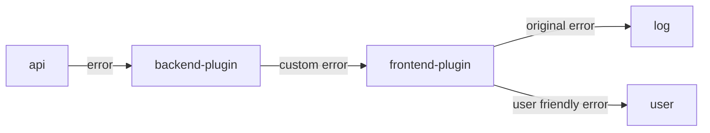
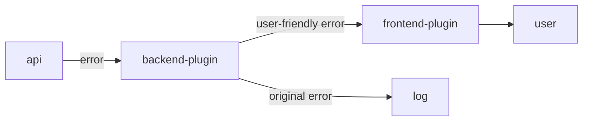
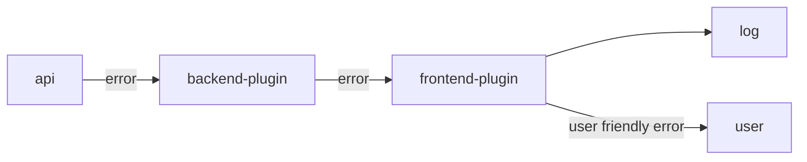
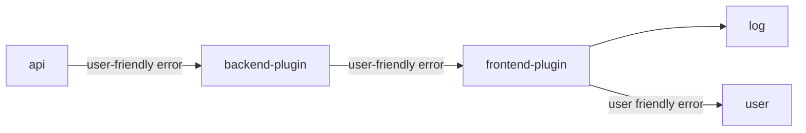

# 1. add backend error handling

Date: 2021-08-31

## Status

Accepted

## Context

[Error handling](https://www.grpc.io/docs/guides/error/) is an important aspect of grpc communication. GRPC errors are technical and should not appear in any user interface. The initial version of this plugin simply printed backend error messages which is not very user-friendly.

## Decision Drivers

* back-end plugin logs might not be available to end-users.
* by far most errors originate from back-end server.
* technical error details are available in back-end server and aren’t required in front-end plugin (assuming direct or indirect access to back-end server).

### Option 1: wrap grpc errors in a custom type

The error message returned by the backend api is wrapped into a new error type. This new error has a user-friendly message and includes the original error. The frontend plugin logs the original (inner) error and shows the user-friendly message to the user.  

*note*: currently the grafana backend plugin sdk framework support string based error messages only. For this scenario it would mean that the original error has to be encoded in the error string. This would result in a parser of the error string at the client side. 
For example: 
* backend api returns `{"status": "ResourceExhausted", "desc": "too many requests"}`
* backend plugin returns  `"status: ResourceExhaused, desc: \"too many requests\", msg: \"too many concurrent queries\"`

the frontend plugin has to parse this string into an object, log the inner error and displays the user-friendly message. 

Pros: 
* original error message is still available at the client side 
* especially useful if grafana is hosted by a third party

Cons:
* strict coupling between frontend and backend 
* frontend needs to have knowledge about backend errors 

### Option 2: backend plugin returns friendly error messages

The backend plugin inspects backend api error, logs the error and returns a user-friendly error to the frontend plugin. 
The content of the user-friendly message depends on the grpc status code. 

**For example:** 
Backend api returns a `ResourceExhausted` error. It provides details about the grpc operation which caused the rate limit to be exceeded. The backend plugin logs these details to the console. The error translates into a message `Too many concurrent queries; reduce the number of concurrent queries to circumvent this issue`     

Pros: 
* simple 
* compatible with enhanced backend API errors (`google.golang.org/genproto/googleapis/rpc/errdetails`)  
* Frontend does not need any knowledge about error details 

Cons: 
* original error details are not available within the plugin context if grafana is hosted by third party 

### Option 3: client displays a generic error and logs details to the console

The error from the backend api is passed through until it reaches the frontend plugin. The frontend plugin logs the original error and displays a user-friendly error message to the user

Pros: 
  * access to original backend api error even if grafana is hosted by third party 

Cons: 
  * backend errors are just strings; difficult to match these strings to find appropriate user error messages. 

### Option 4: Backend API returns user-friendly errors 

In this option errors from the backend api are simply passed on through back-end plugin and unpacked in front-end plugin (split string to print only ‘desc’ section of the grpc error message). 

Pros: 
* simplest solution from the plugin’s point of view
* consistent error handling 
* ability to tailor error message for grafana ux

Cons: 

## Decision

Option 4 seems to be the best choice. 

## Consequences

Original errors are not available within the plugin context if grafana is hosted by a third party. One of the initial requirements for this plugin was to have access to the grpc errors. After reconsideration, it was decided to drop this requirement. Logging backend errors is more a responsibility of the backend api.   
